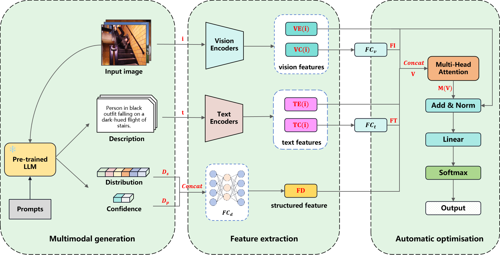

# Improving Vision-based Anomaly Scene Recognition by Using Large Language Models



## Preparation

(1) Prepare for datasets:
The training and validation data is expected to be in the `train` folder and `val` folder respectively, with annotation information saved in csv files:
```
/path/to/dataset
  │── Processed-Frames
  │      │── class1
  │         ├── img1.jpg
  │      ├── class2
  │         ├── img2.jpg
  │      ├── class3
  │         ├── img3.jpg
  │
  │── train.csv
  │── test.csv
```

(2) Configuration
```bash
$ pip install -r requirements.txt
```

## Train AnoSRe with vit-b/16 and RoBerta-base on UCF-Crime
```bash
$ python -m main.py --config ./configs/UCF_Crime_Image.json --VE vit_b_16 --TRE roberta_base --FD FD --VCE vision_clip --TCE text_clip --save_dir ./output
```

## Train AnoSRe with your own encoder components
(1) Add your encoder components in model.py

(2) Run the script
```bash
$ python -m main.py --config ./configs/TOUR_CONFIG --VE YOUR_VISION_ENCODER --TRE YOUR_TEXT_ENCODER --FD YOUR_DATA_ENCODER --VCE YOUR_VISION_ENCODER2 --TCE YOUR_TEXT_ENCODER2 --save_dir ./output
```
